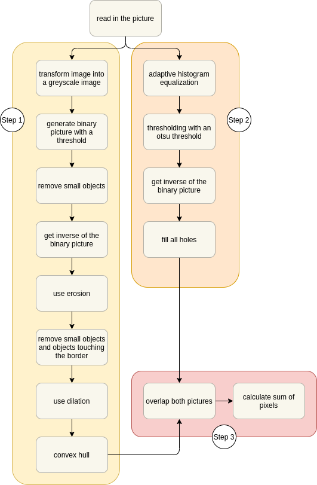

# Bioimaging_LeafSize_calculation

This repository contains a project to calculate the size of scanned leaves. The project was done as part of the Uni course 'Bioimage Analysis and Phenotyping' in the winter term 2020/2021. 

## Authors <!-- omit from toc -->

- Lea Burkard (@leaburkard)
- Sandra Heckmann (@Sandra-Heckmann)

## Table of Contents <!-- omit from toc -->

- [Bioimaging\_LeafSize\_calculation](#bioimaging_leafsize_calculation)
  - [Research question](#research-question)
  - [Experimental setup](#experimental-setup)
  - [Computation](#computation)
  - [Strategies](#strategies)
    - [Default strategy](#default-strategy)
    - [Yellow leaf strategy](#yellow-leaf-strategy)
  - [Results](#results)

## Research question

Some plants can be propagated by cutting the stem with at least one leaf. These cuttings have no roots and need optimal conditions to grow them which are a moist medium or water, a warm environment and to be kept out of direct sunlight. The cuttings remain physiologically active. One plant with which this propagation works nicely is *Epipremnum aureum*. The research question of this project was what number of leaves works best for propagating this plant with hydroponics. The null hypothesis was that the number of leaves has no influence on the growth of the cuttings.

## Experimental setup

Leaf cuttngs with 1 to 4 leaves (4 technical replicates each) were cut and propagated in fresh water. The leaves surface was recorded on day 0 (day of cutting) and after 74 days with a flatbed scanner (600 dpi) to compare size. A size key was added to each scan.

## Computation

The leaf size was calculated in Python using image manipulation techniques. No automated workflow was possible due to different qualities of the scans. Therefore each imae was indiviudally prepared with adjusted parameters with one of two strategies.

Dependencies:
- Python 3.8.3
- scikit-image 0.16.2
- numpy 1.18.5

## Strategies

### Default strategy

<figure>
  
  <figcaption>
  
 <strong>Figure 1: </strong> Workflow showing the default strategy to calculate the leaf size of the scan. 
  

  </figcaption>
</figure>

### Yellow leaf strategy

Problem: some leaves had some yellow parts (instead of green) that were recognized as part of the background in the binary picture. This lead to large parts of some leaves that were missing.

Solution:
- calculate the standard deviation across color channels (third dimension)
- simple thresholding to get the binary picture and inverse it
- then again erosion, noise removal and dilution to remove background noise like the stem and make a convex hull
- then perform step 2 and 3 like in the default strategy

This strategy was more time complex and needed more computational resources and was therefore only used for pictures with large yellow parts. 

## Results

How does the leaf surface area change from before to after the experiment?

- Before the experiment (day 0): the leaf surface area correlates to the number of leaves
- After the experiment (day 74): not as clead anymore
- leaf surface area of smaller cuttings stays the same or grows
- leaf surface area of larger cuttings shrinks on average (maybe a sign of bad health of the plants)
- null hypothesis rejected